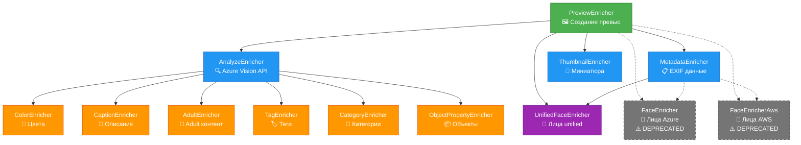
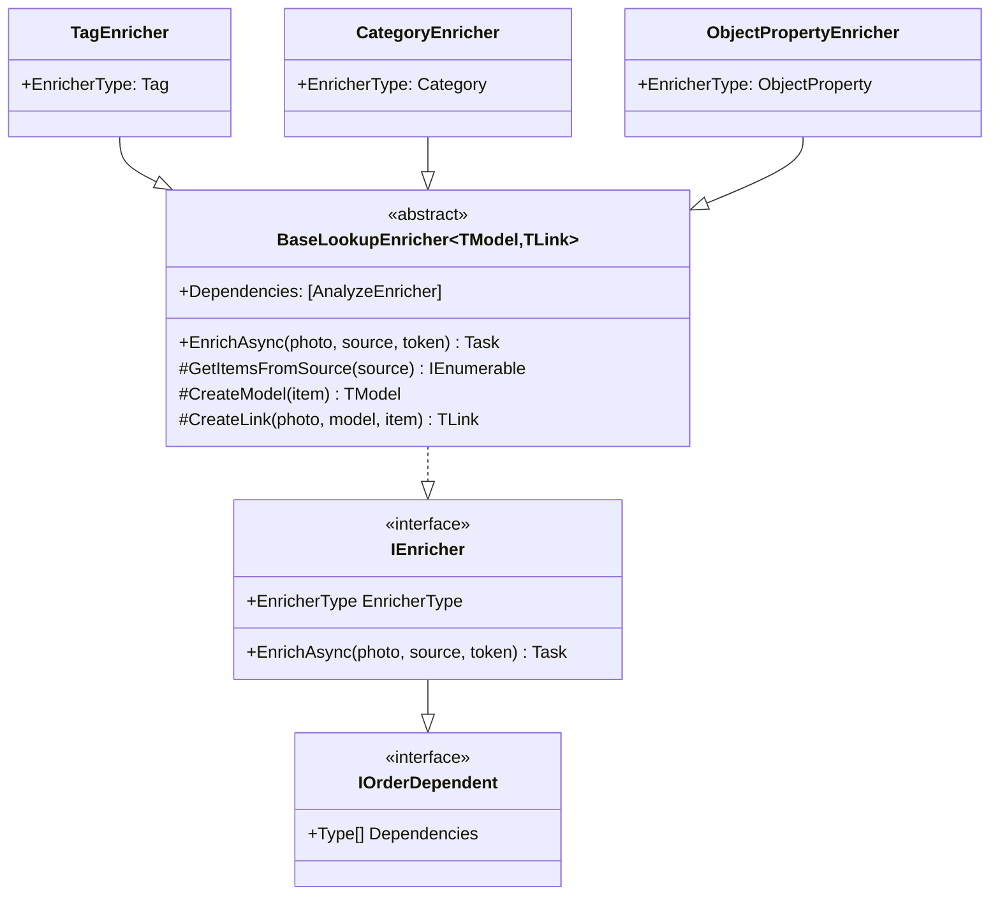

# Схема зависимостей энричеров PhotoBank

## Граф зависимостей



## Уровни зависимостей

### 🟢 Уровень 0 - Корневой
- **PreviewEnricher** - создает preview изображения из оригинального файла
  - Зависимостей: нет
  - Сервисы: `IImageService` (ImageMagick)

### 🔵 Уровень 1 - Базовый анализ
- **AnalyzeEnricher** - анализирует изображение через Azure Computer Vision API
  - Зависимости: `PreviewEnricher`
  - Сервисы: `IComputerVisionClient` (Azure)
  - Извлекает: Categories, Description, Tags, Objects, Colors, Adult content

- **MetadataEnricher** - извлекает EXIF метаданные из файла
  - Зависимости: `PreviewEnricher`
  - Сервисы: `IImageMetadataReaderWrapper` (MetadataExtractor)
  - Извлекает: Дата съемки, GPS, Camera info

- **ThumbnailEnricher** - генерирует миниатюру 50x50px
  - Зависимости: `PreviewEnricher`
  - Сервисы: `IComputerVisionClient` (Azure)

### 🟠 Уровень 2 - Детализация анализа
Все следующие энричеры зависят от **AnalyzeEnricher** и обрабатывают результаты его работы:

- **ColorEnricher** - извлекает информацию о цветах
  - Данные: IsBW, AccentColor, DominantColors

- **CaptionEnricher** - извлекает описания изображения
  - Данные: Captions с confidence scores

- **AdultEnricher** - проверяет на adult/racy контент
  - Данные: AdultScore, RacyScore

- **TagEnricher** - создает/связывает теги
  - Базовый класс: `BaseLookupEnricher<Tag, PhotoTag>`
  - База данных: `IRepository<Tag>`

- **CategoryEnricher** - создает/связывает категории
  - Базовый класс: `BaseLookupEnricher<Category, PhotoCategory>`
  - База данных: `IRepository<Category>`

- **ObjectPropertyEnricher** - создает/связывает обнаруженные объекты
  - Базовый класс: `BaseLookupEnricher<PropertyName, ObjectProperty>`
  - База данных: `IRepository<PropertyName>`

### 🟣 Уровень 1+2 - Комбинированные зависимости
- **UnifiedFaceEnricher** ✅ - универсальный детектор лиц
  - Зависимости: `PreviewEnricher` + `MetadataEnricher`
  - Сервисы: `IUnifiedFaceService` (поддержка Azure/AWS/Local провайдеров)
  - Функции: Определение лиц, возраст, пол, эмоции, создание preview лиц

### ⚠️ Устаревшие энричеры (DEPRECATED)
- **FaceEnricher** - только Azure Face API
  - Зависимости: `PreviewEnricher` + `MetadataEnricher`
  - Статус: `[Obsolete("Use UnifiedFaceEnricher instead")]`

- **FaceEnricherAws** - только AWS Rekognition
  - Зависимости: `PreviewEnricher` + `MetadataEnricher`
  - Статус: `[Obsolete("Use UnifiedFaceEnricher instead")]`

## Базовые классы



## Порядок выполнения

Enrichment Pipeline использует топологическую сортировку для определения порядка выполнения:

1. **PreviewEnricher** (корневой)
2. **Параллельно:**
   - AnalyzeEnricher
   - MetadataEnricher
   - ThumbnailEnricher
3. **После AnalyzeEnricher (параллельно):**
   - ColorEnricher
   - CaptionEnricher
   - AdultEnricher
   - TagEnricher
   - CategoryEnricher
   - ObjectPropertyEnricher
4. **После PreviewEnricher + MetadataEnricher:**
   - UnifiedFaceEnricher

## Статистика

- **Всего энричеров:** 11 (9 активных + 2 устаревших)
- **Уровней зависимостей:** 3
- **Внешних сервисов:** 4 (Azure Vision, Azure Face, AWS Rekognition, MetadataExtractor)
- **Репозиториев БД:** 3 (Tag, Category, PropertyName)
- **Поддержка параллелизма:** Да (`RunBatchAsync`)

## Компоненты оркестрации

### EnrichmentPipeline
- Выполняет энричеры в правильном порядке
- Топологическая сортировка зависимостей
- Обработка ошибок (continue-on-error)
- Параллельная пакетная обработка

### EnricherDependencyResolver
- Алгоритм: Топологическая сортировка Кана
- Обнаружение циклических зависимостей
- Валидация отсутствующих зависимостей

### ActiveEnricherProvider
- Загружает активные энричеры из БД
- Позволяет включать/выключать энричеры без изменения кода

## Использование в проекте

```csharp
// Запуск всех активных энричеров
await enrichmentPipeline.RunAsync(photo, sourceData, cancellationToken);

// Запуск конкретных энричеров
var enrichers = new[] {
    typeof(PreviewEnricher),
    typeof(AnalyzeEnricher)
};
await enrichmentPipeline.RunAsync(photo, sourceData, enrichers, cancellationToken);

// Пакетная обработка
var items = photos.Zip(sources, (p, s) => (p, s));
await enrichmentPipeline.RunBatchAsync(items, cancellationToken);
```

## Ссылки на код

- Интерфейсы: `backend/PhotoBank.Services/Enrichers/IEnricher.cs:1`
- Базовый класс: `backend/PhotoBank.Services/Enrichers/BaseLookupEnricher.cs:1`
- Pipeline: `backend/PhotoBank.Services/Enrichment/EnrichmentPipeline.cs:1`
- Resolver: `backend/PhotoBank.Services/Enrichment/EnricherDependencyResolver.cs:1`
- Регистрация: `backend/PhotoBank.DependencyInjection/AddPhotobankConsoleExtensions.cs:1`
